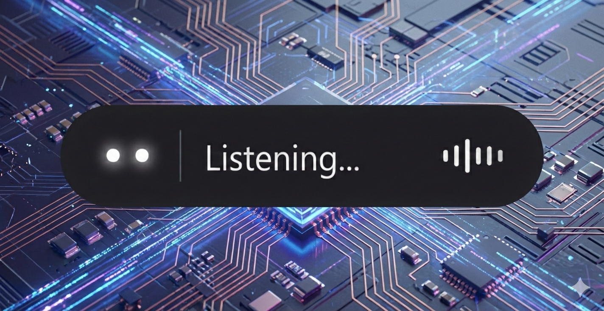

<p align="center">
  
</p>

<h1 align="center">Writher</h1>

<p align="center">
  <strong>Voice-powered productivity for Windows — dictate text anywhere or manage notes, appointments and reminders hands-free.</strong>
</p>

<p align="center">
  
  
  
  
  
</p>

---

## What is Writher?

Writher sits quietly in your system tray and gives you two super-powers:

| Mode | Hotkey | What it does |
|---|---|---|
| **Dictation** | Hold `AltGr` | Transcribes your voice and pastes the text directly into whichever app has focus — editors, browsers, chat windows, anything. |
| **Assistant** | Hold `Ctrl+R` | Understands natural-language commands and saves notes, creates appointments, sets reminders, manages lists — all by voice. |

Everything runs **locally**: speech recognition via [faster-whisper](https://github.com/SYSTRAN/faster-whisper), intent parsing via [Ollama](https://ollama.com), and data stored in a local SQLite database. No cloud, no API keys, no telemetry.

---

## Features

- **Real-time dictation** — hold a key, speak, release, text appears. Clipboard is saved and restored automatically.
- **Voice-controlled assistant** — save notes, create shopping/todo lists, schedule appointments, set reminders, all through natural speech.
- **Smart date parsing** — say *"remind me tomorrow at 9"* or *"meeting next Monday at 3pm"* and the LLM converts relative times to absolute datetimes.
- **Toast notifications** — get Windows notifications when reminders fire or appointments are approaching.
- **Animated floating widget** — a minimal pill-shaped overlay with expressive "Pandora Blackboard" eyes that react to state (listening, thinking, happy, error, etc.).
- **Notes & Agenda window** — a dark-themed borderless window to browse, check off list items, and delete notes/appointments/reminders.
- **Multi-language** — ships with English and Italian; easy to add more via the `locales.py` string table.
- **Fully offline** — no internet required after model download.

---

## Architecture

```
┌──────────────────────────────────────────────────────┐
│                     main.py                          │
│            (orchestrator + Tk event loop)             │
├──────────┬───────────┬───────────┬───────────────────┤
│ hotkey   │ recorder  │ widget    │ tray_icon          │
│ listener │ (audio)   │ (overlay) │ (system tray)      │
├──────────┴───────────┴───────────┴───────────────────┤
│                                                      │
│  Dictation pipeline          Assistant pipeline      │
│  ┌───────────┐               ┌───────────┐           │
│  │transcriber│               │transcriber│           │
│  │ (Whisper) │               │ (Whisper) │           │
│  └─────┬─────┘               └─────┬─────┘           │
│        ▼                           ▼                 │
│   injector                    assistant              │
│  (clipboard                  (Ollama LLM             │
│   + Ctrl+V)                  + function calls)       │
│                                    │                 │
│                                    ▼                 │
│                               database               │
│                              (SQLite)                │
│                                    │                 │
│                              notifier                │
│                          (toast scheduler)            │
└──────────────────────────────────────────────────────┘
```

---

## Requirements

- **Windows 10/11**
- **Python 3.11+**
- **Ollama** running locally (for the assistant mode)
- A working **microphone**

---

## Installation

### 1. Clone the repository

```bash
git clone https://github.com/benmaster82/writher.git
cd writher
```

### 2. Create a virtual environment (recommended)

```bash
python -m venv venv
venv\Scripts\activate
```

### 3. Install dependencies

```bash
pip install faster-whisper numpy sounddevice pynput pystray Pillow requests winotify
```

> **Optional:** install `plyer` as a fallback notification backend:
> ```bash
> pip install plyer
> ```

### 4. Install and start Ollama

Download from [ollama.com](https://ollama.com), then pull a model that supports function calling:

```bash
ollama pull llama3.1
```

Update `config.py` with your model name:

```python
OLLAMA_MODEL = "llama3.1"
```

### 5. Run

```bash
python main.py
```

Writher appears in the system tray. Hold `AltGr` to dictate, hold `Ctrl+R` for assistant commands.

---

## Configuration

All settings live in **`config.py`**:

```python
# Hotkeys
HOTKEY = Key.alt_gr            # Dictation
ASSISTANT_HOTKEY = Key.ctrl_r  # Assistant

# Language ("en" or "it")
LANGUAGE = "en"

# Whisper
MODEL_SIZE = "base"            # tiny, base, small, medium, large-v3
DEVICE = "cpu"                 # "cpu" or "cuda"
COMPUTE_TYPE = "int8"          # int8, float16, float32

# Ollama
OLLAMA_URL = "http://localhost:11434"
OLLAMA_MODEL = "gpt-oss:120b-cloud"

# Notification lead time
APPOINTMENT_REMIND_MINUTES = 15
```

### Choosing a Whisper model

| Model | Size | Speed | Accuracy |
|---|---|---|---|
| `tiny` | 39 MB | ⚡ fastest | basic |
| `base` | 74 MB | ⚡ fast | good (default) |
| `small` | 244 MB | moderate | better |
| `medium` | 769 MB | slower | great |
| `large-v3` | 1.5 GB | slowest | best |

For CUDA acceleration, install `ctranslate2` with CUDA support and set `DEVICE = "cuda"`.

---

## Usage

### Dictation mode

1. Focus any text field (editor, browser, chat…)
2. **Hold** `AltGr`
3. Speak
4. **Release** — transcribed text is pasted automatically

### Assistant mode

1. **Hold** `Ctrl+R`
2. Speak a command
3. **Release** — Writher processes and confirms

**Example commands:**

- *"Save a note: remember to buy milk"*
- *"Create a shopping list: bread, eggs, butter, coffee"*
- *"Add pasta to the shopping list"*
- *"Appointment with the dentist tomorrow at 3pm"*
- *"Remind me to call Marco in one hour"*
- *"Show me my notes"*
- *"Show my agenda"*

### System tray

Right-click the tray icon to open **Notes & Agenda** or to **Quit**.

---

## Adding a language

1. Open `locales.py`
2. Add a new entry to the `_STRINGS` dictionary (copy `"en"` as a template)
3. Set `LANGUAGE` in `config.py` to your language code

---

## Project structure

```
writher/
├── main.py              # Entry point and orchestrator
├── config.py            # All user-configurable settings
├── hotkey.py            # Dual-hotkey listener (pynput)
├── recorder.py          # Microphone recording (sounddevice)
├── transcriber.py       # Speech-to-text (faster-whisper)
├── injector.py          # Clipboard paste into active app (Win32 API)
├── assistant.py         # Ollama LLM integration + function calling
├── database.py          # SQLite storage (notes, appointments, reminders)
├── notifier.py          # Toast notifications + reminder/appointment scheduler
├── widget.py            # Floating pill overlay with animated eyes
├── notes_window.py      # Notes/Agenda/Reminders viewer window
├── tray_icon.py         # System tray icon (pystray)
├── brand.py             # "Pandora Blackboard" icon renderer
├── locales.py           # i18n string tables (EN, IT)
├── logger.py            # Rotating file + console logger
├── debug_keys.py        # Key event debugger utility
├── requirements.txt     # Python dependencies
├── img/
│   └── logo_writher.png # Logo for README
└── LICENSE
```

---

## Troubleshooting

**AltGr not detected?**
Run `python debug_keys.py` to see exactly what pynput reports for your keyboard. Some keyboard layouts map AltGr differently.

**Ollama not reachable?**
Make sure Ollama is running (`ollama serve`) and the URL in `config.py` matches. The tray tooltip will show a warning if the connection fails at startup.

**No audio / microphone not found?**
Writher uses the system default input device. Check your Windows sound settings. The widget will display a "🎤 No microphone detected" message if the device can't be opened.

**Text not pasting?**
The injector uses `Ctrl+V` via the clipboard. Some apps with custom input handling may not respond. If injection fails, the text is saved to `recovery_notes.txt` so nothing is lost.

---

## License

MIT

---

<p align="center">
  <sub>Built with 🎙️ faster-whisper · 🧠 Ollama · 🐍 Python</sub>
</p>
